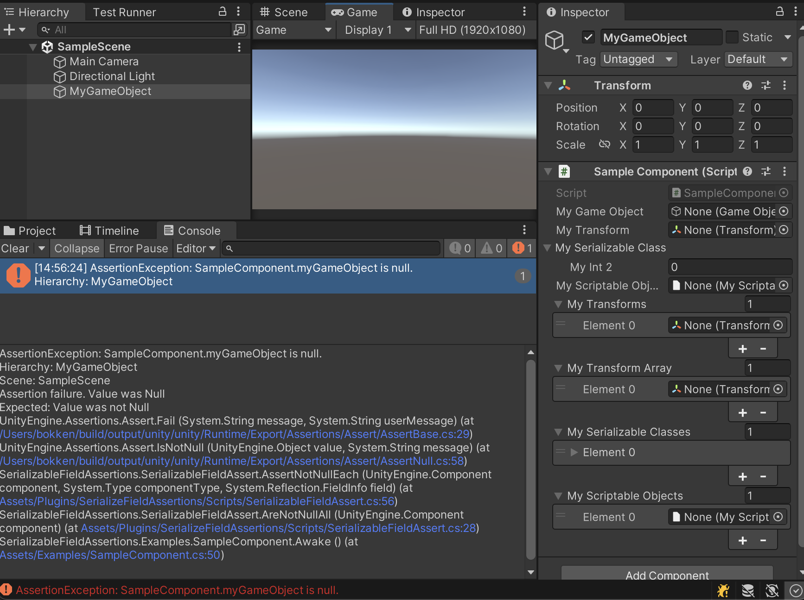

# Serializable Field Assertions

Provides simple assertion methods for serializable fields with readable error messages in Unity.

```cs
using System;
using System.Collections.Generic;
using UnityEngine;
using SerializableFieldAssertions;

public class SampleComponent : MonoBehaviour
{
    // UnityEngine.Object marked as [SerializeField] is serialized, and it can be null.
    [SerializeField] private GameObject myGameObject = null!;
    // public field UnityEngine.Object is serialized, and it can be null.
    public Transform MyTransform = null!;
    // T[] where T : UnityEngine.Object can contain null elements, but the array itself cannot be null.
    [SerializeField] private Transform[] myTransformArray = null!;

    private void Awake()
    {
        // Asserts that all serializable fields are not null with readable message.
        // 
        // --- output example ---
        // AssertionException: SampleComponent.myGameObject is null.
        // Hierarchy: MyGameObject
        // Scene: TestScene
        // 
        // --- output example (Array or List) ---
        // AssertionException: SampleComponent.myTransformArray contains null elements.
        // Index: 0
        // Hierarchy: MyGameObject
        // Scene: TestScene
        SerializableFieldAssert.AreNotNullAll(this);

        // Asserts that specified serializable field is not null with readable message.
        SerializableFieldAssert.IsNotNull(this, nameof(myGameObject));
    }
}
```



## Features

By calling `SerializableFieldAssert.AreNotNullAll(this);` in the `Awake` method of a `Component`, you can assert that all serializable fields, such as those marked with `[SerializeField]`, are not null.

```cs
private void Awake()
{
    // Asserts that all serializable fields are not null.
    SerializableFieldAssert.AreNotNullAll(this);
}
```

The assertion is marked with `[Conditional("UNITY_ASSERTIONS")]`, the same as `UnityEngine.Assertions.Assert.IsNotNull`, so assertions are disabled in release build.

For more details about serializable fields, refer to the official documentation:

[Unity - Manual: Script serialization](https://docs.unity3d.com/2022.3/Documentation/Manual/script-Serialization.html)

## Install

You can add https://github.com/doyasu24/SerializableFieldAssertions.git?path=Assets/Plugins/SerializableFieldAssertions#0.1.0 to Package Manager.

## License

MIT License
